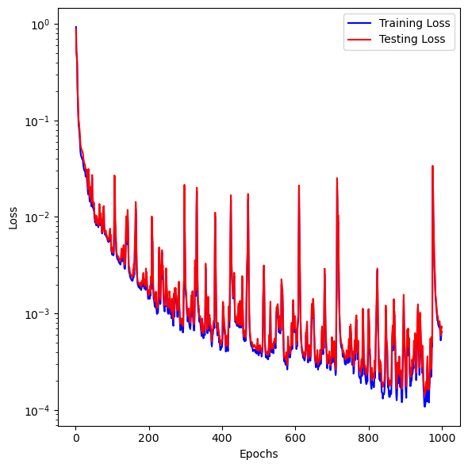
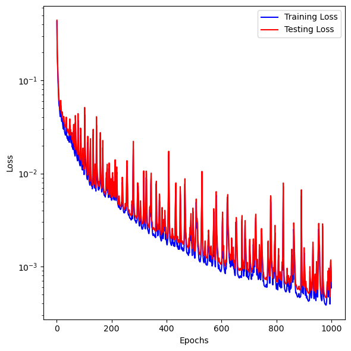

We collected various implementations of DeepONet. The big issue was making sure that format of the data is correct and the matrix operations with the input and output data are valid. In the end, we have three different implementations of DeepONet, using tensorflow v1, pytorch, and jax. 

The motivation for trying multiple implementation is to:
- understand core algorithms by implementing the method from scratch without much dependencies
- to see how data is used in branch and trunk network
- needs could dictate implementation using specific libraries, so it is a good idea to see how it can be done from scratch

> The notebooks in this folder are self-contained and do not depend on any other functions in this repository. You just need to install the required libraries using `neuralop.yml` file from the root directory of this repository. 

# Problem and data generation

The forward problem is based on Poisson equation, and the map of interest is the one that takes Dirichlet boundary condition function to the solution of the PDE. The dmain is a triangular with a notch. The numerical solution and the implementation in Matlab is from the repository [deeponet-fno](https://github.com/lu-group/deeponet-fno/tree/main).

To generate data, run the following
```
cd data
matlab main
```

It should produce `bc.mat`, `Darcy_Triangulation.mat`, `Darcy_Triangular_FNO.mat`, and `Mesh.mat`. 

> For the implementation, we only need `Darcy_Triangulation.mat` which is included in the repository. 

# Implementations of DeepONet

All implementations have the same format of the data. Various numbers in data are as follow:
- $N$ - Number of input functions
- $M$ - Number of elements in one input function (number of nodal values after the discretization of input function)
- $P$ - Number of spatial points in 2D at which the output function is evaluated. 
For the branch input, data is of size $N\times M$. For trunk, data is of size $P\times 2$, and the output data is of the size $N\times P$. 

In all implemetations, the branch and trunk networks have total four layers. The hidden layers have 128 neurons. The branch and trunk networks each produce 100 outputs which are multiplied and the bias is added to get the final output from the DeepONet. 

In all implementations, `epochs = 10000`, `batch_size = 100`, and `learning_rate = 1.e-3` are used. 

## from_deeponet-fno.ipynb
Notebook [from_deeponet-fno.ipynb](from_deeponet-fno.ipynb) shows the implemntation of DeepONet from the directory [deeponet-fno/src/darcy_triangular_notch
/deeponet](https://github.com/lu-group/deeponet-fno/tree/main/src/darcy_triangular_notch/deeponet) of [deeponet-fno](https://github.com/lu-group/deeponet-fno/tree/main) library. We made few minor changes but the core implementation is from the mentioned source. The method is based on tensorflow `tensorflow.compat.v1`.

<p align="center">  </p>

<p align="center">  </p>

## from_GideonIlung_deeponet.ipynb
Notebook [from_GideonIlung_deeponet.ipynb](from_GideonIlung_deeponet.ipynb) implements DeepONet following [DeepONet](https://github.com/GideonIlung/DeepONet) repository. Some minor changes are introduced. This method uses `pytorch`. 

<p align="center">  </p>

<p align="center">  </p>

## improved_from_PredictiveIntelligenceLab_physics-informed.ipynb
Notebook [improved_from_PredictiveIntelligenceLab_physics-informed.ipynb](improved_from_PredictiveIntelligenceLab_physics-informed.ipynb) implements DeepONet following [Physics-informed-DeepONets](https://github.com/PredictiveIntelligenceLab/Physics-informed-DeepONets/tree/main) library. This is based on `jax`. The original implementation is buggy and data intensive. It needs data in the form of $(N*P) \times M$ for branch input, $(N*P)\times 2$ for trunk input, and $(N*P) \times 1$ for output, where
- $N$ - Number of input functions
- $M$ - Number of elements in one input function (number of nodal values after the discretization of input function)
- $P$ - Number of spatial points in 2D at which the output function is evaluated. 
In our case, $N = 1900$ = number of training input functions, $M = 101$ = elements in discretization of one input function, and $P=2397$ = nodes in the finite element mesh of the domain which are also used as spatial locations to evaluate the output function. With these numbers, the size of data is pretty large. The workstation with 64 Gb ram could not handle the code, and could not finish even a single optimization step. 

In the current implementation, we use the data as in the first two implementation, and the code is quite fast in training and memory efficient. 

<p align="center">  </p>

<p align="center">  </p>
